# VolineUI

VolineUI is an Android UI component library by **5Degree**. It provides production-ready form controls, feedback components, image handling, and platform utilities with **two parallel APIs**:

- **View-based** — custom `View` subclasses usable from XML layouts and traditional Activities/Fragments
- **Jetpack Compose** — matching composables under `in.fivedegree.volineui.compose`

The companion `:app` module in this repository is a demo app with side-by-side View and Compose examples for every component.

## Installation

VolineUI is published on **Maven Central** as `io.github.5degree:volineui`. The transitive `:volinecore` module (Firebase, Room, offline queue, etc.) is pulled in automatically — you do not need to add it separately.

### Gradle (Kotlin DSL)

```kotlin
// app/build.gradle.kts
dependencies {
    implementation("io.github.5degree:volineui:1.0.0")
}
```

Maven Central is included by default in modern Android projects (AGP 7+), so no `repositories {}` changes are required.

### Gradle (Groovy)

```groovy
// app/build.gradle
dependencies {
    implementation 'io.github.5degree:volineui:1.0.0'
}
```

### Version catalog (`gradle/libs.versions.toml`)

```toml
[versions]
volineui = "1.0.0"

[libraries]
volineui = { module = "io.github.5degree:volineui", version.ref = "volineui" }
```

```kotlin
// app/build.gradle.kts
dependencies {
    implementation(libs.volineui)
}
```

### Requirements

| | |
|---|---|
| Min SDK | 24 |
| Compile SDK | 36 |
| JVM target | 17 |
| Kotlin | 2.0+ (Compose-enabled) |

## Screenshots

<table>
  <tr>
    <td align="center" width="33%"><strong>Button</strong></td>
    <td align="center" width="33%"><strong>Button (Variants)</strong></td>
    <td align="center" width="33%"><strong>Input Field</strong></td>
  </tr>
  <tr>
    <td>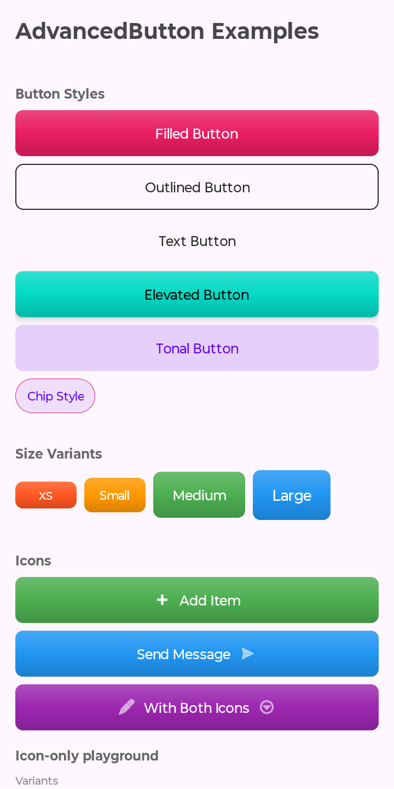</td>
    <td>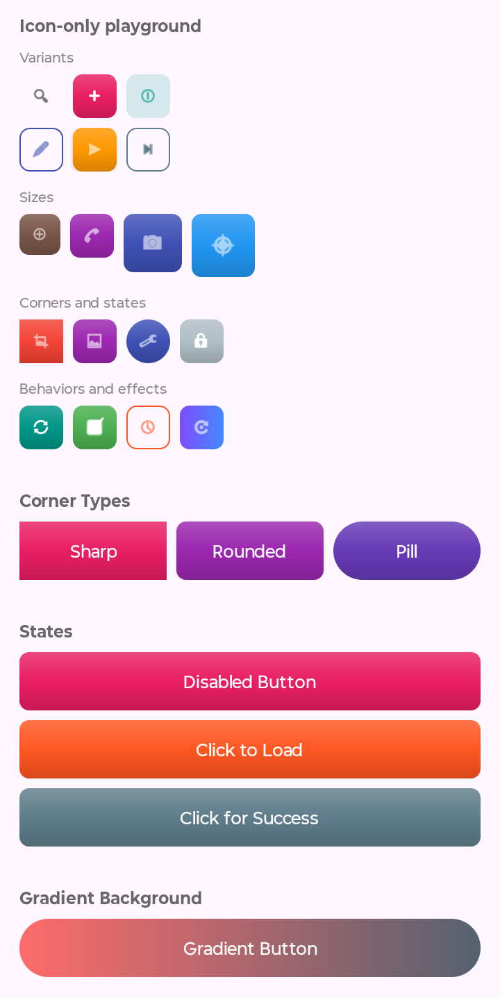</td>
    <td>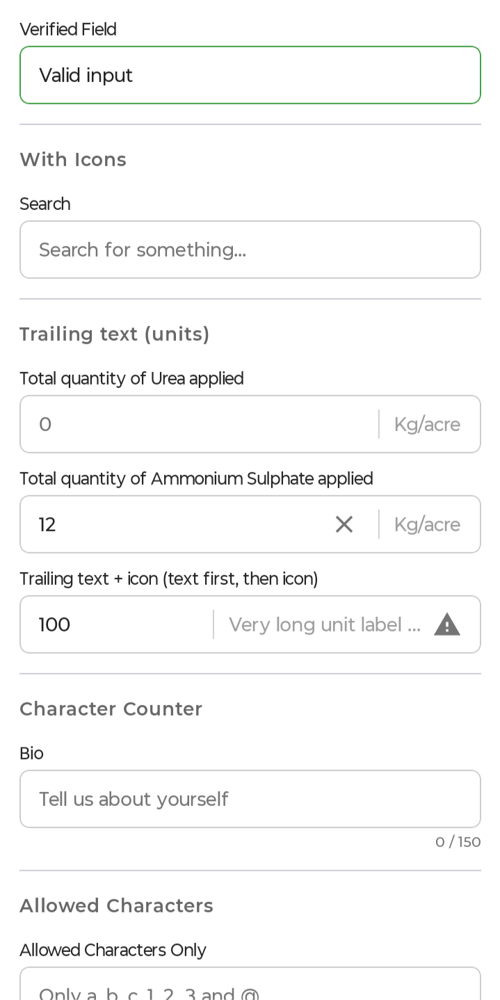</td>
  </tr>
  <tr>
    <td align="center" width="33%"><strong>Dropdown</strong></td>
    <td align="center" width="33%"><strong>Radio</strong></td>
    <td align="center" width="33%"><strong>Date Time Picker</strong></td>
  </tr>
  <tr>
    <td>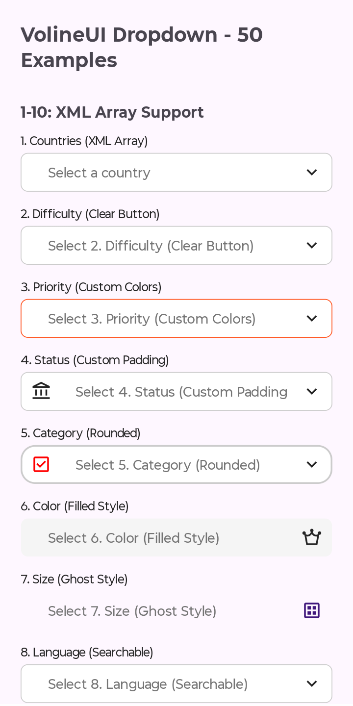</td>
    <td>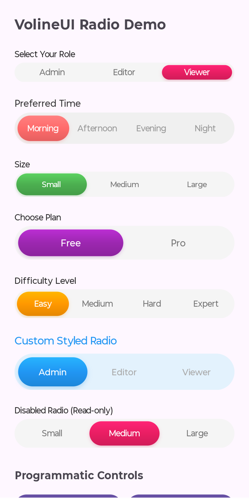</td>
    <td>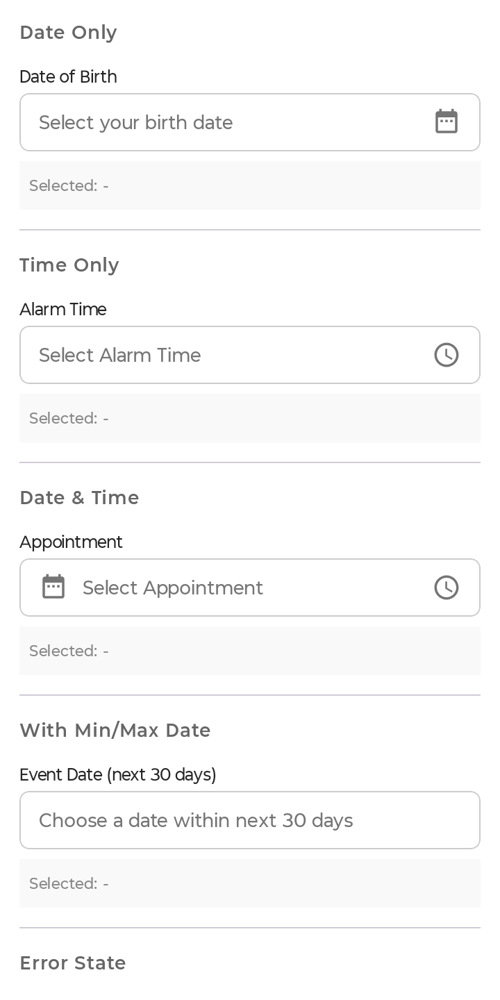</td>
  </tr>
  <tr>
    <td align="center" width="33%"><strong>Dialog</strong></td>
    <td align="center" width="33%"><strong>Toast</strong></td>
    <td align="center" width="33%"><strong>Image View</strong></td>
  </tr>
  <tr>
    <td>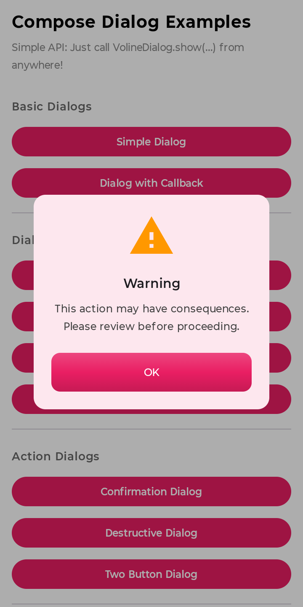</td>
    <td>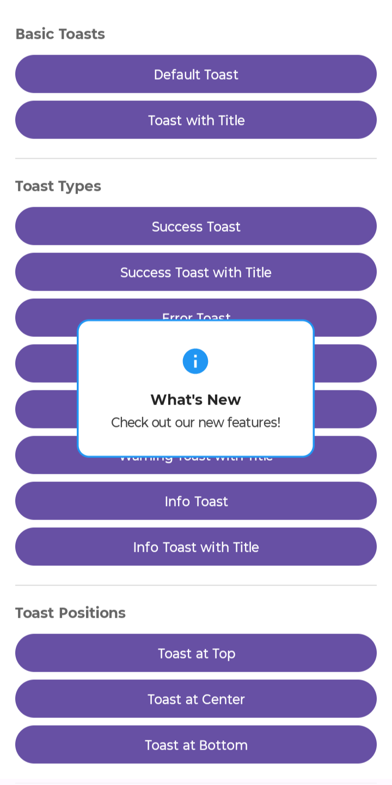</td>
    <td>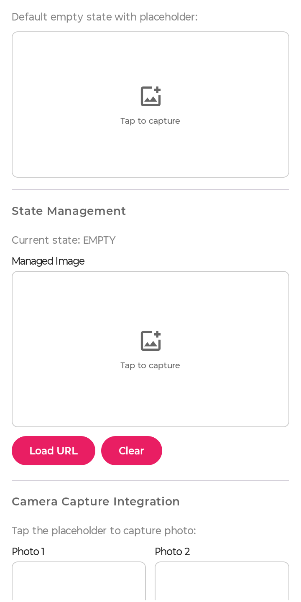</td>
  </tr>
  <tr>
    <td align="center" width="33%"><strong>Image View (Gallery)</strong></td>
    <td align="center" width="33%"><strong>Image View (Preview)</strong></td>
    <td align="center" width="33%"><strong>Image Carousel</strong></td>
  </tr>
  <tr>
    <td>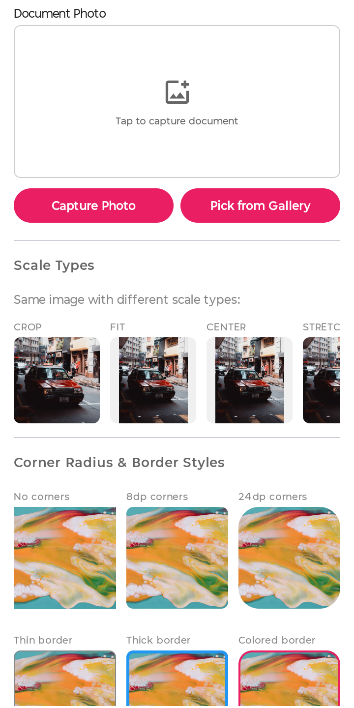</td>
    <td>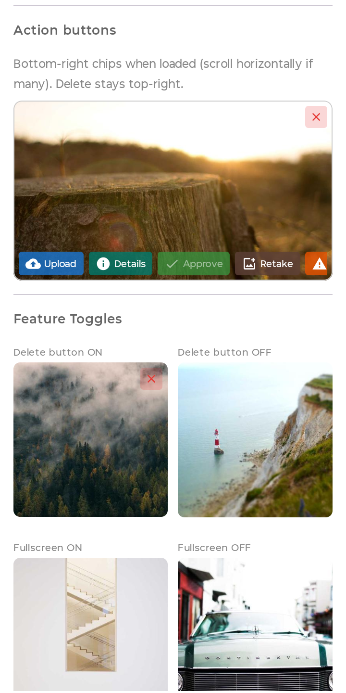</td>
    <td>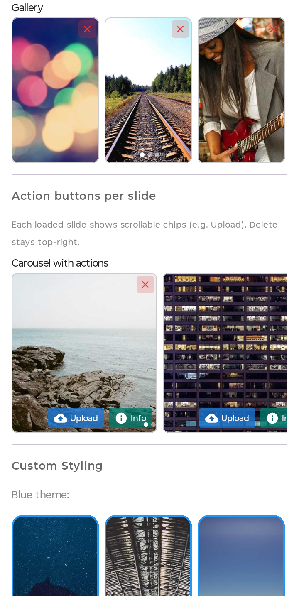</td>
  </tr>
</table>

## Quick start
### Initialize managers (Application)

`PermissionManager`, `LocationManager`, and `PhotoCaptureManager` are singletons that should be initialized once in your `Application` class:

```kotlin
class MyApp : Application() {
    override fun onCreate() {
        super.onCreate()

        PermissionManager.init(
            this,
            Manifest.permission.CAMERA,
            Manifest.permission.ACCESS_FINE_LOCATION,
            Manifest.permission.ACCESS_COARSE_LOCATION,
        )
        LocationManager.init(this)
        PhotoCaptureManager.init(this)
    }
}
```

Register the class in `AndroidManifest.xml`:

```xml
<application android:name=".MyApp" ... />
```

### Compose global overlays

For global toast and dialog helpers in Compose, add containers once at the root of your UI:

```kotlin
@Composable
fun MyApp() {
    MaterialTheme {
        VolineToast.Container()
        VolineDialog.Container()
        // ... rest of app
    }
}
```

Then show feedback from anywhere:

```kotlin
VolineToast.success("Saved!")
VolineDialog.confirm(
    title = "Delete?",
    message = "This cannot be undone.",
    onConfirm = { /* ... */ }
)
```

## Components

### UI controls

| Component | View (XML) | Compose | Notes |
|-----------|:----------:|:-------:|-------|
| AdvancedButton | ✓ | ✓ | Filled, outlined, text, FAB, chip, icon styles; loading/success/error states |
| InputField | ✓ | ✓ | Validation, masks, password toggle, trailing text, visual states |
| Dropdown | ✓ | ✓ | Single/multi select, search, chips, filtering |
| Radio | ✓ | ✓ | Segmented control with animated pill indicator |
| DateTimePicker | — | ✓ | Date, time, or date+time; styled like InputField |
| SignaturePad | ✓ | — | Drawing, undo/redo, export (PNG, JPG, SVG, Base64) |
| AdvancedImageView | ✓ | ✓ | URL/file/bitmap/URI/base64 sources; camera capture |
| ImageCarousel | ✓ | ✓ | Horizontal image list with indicators and full-screen preview |
| ActionButtonChip | — | ✓ | Compact action chip used by image components |

### Feedback

| Component | View | Compose |
|-----------|:----:|:-------:|
| VolineToast | ✓ (`VolineToast.show(activity, ...)`) | ✓ (`VolineToast.Container()` + static helpers) |
| VolineDialog | ✓ (`VolineDialog.show(context) { ... }`) | ✓ (`VolineDialog.Container()` + static helpers) |

Toast types: `DEFAULT`, `SUCCESS`, `ERROR`, `WARNING`, `INFO`.  
Dialog types: `DEFAULT`, `SUCCESS`, `ERROR`, `WARNING`, `INFO`, `CONFIRMATION`, `DESTRUCTIVE`.

### Platform managers

| Manager | Purpose |
|---------|---------|
| **PermissionManager** | Request/check permissions with callbacks; handles permanent denial and settings redirect |
| **LocationManager** | Cached, one-shot, and streaming location via Fused Location Provider |
| **PhotoCaptureManager** | Camera capture and gallery picker with compression, watermark, and GPS stamping |

`LocationManager` and `PhotoCaptureManager` integrate with `PermissionManager` automatically.

## Usage examples

### View — InputField (XML)

```xml
<in.fivedegree.volineui.InputField
    android:layout_width="match_parent"
    android:layout_height="wrap_content"
    android:hint="Email address"
    app:label="Email"
    app:validationType="email"
    app:enableValidation="true"
    app:showClearIcon="true" />
```

Supported validation types: `none`, `email`, `phone`, `url`, `custom` (with `customValidationPattern`). Input masks use `#` as the placeholder character (e.g. `(###) ###-####`).

### View — VolineDialog

```kotlin
VolineDialog.show(context) {
    title = "Confirm Action"
    message = "Are you sure you want to proceed?"
    type = DialogType.CONFIRMATION
    primaryButtonText = "Confirm"
    secondaryButtonText = "Cancel"
    onPrimaryClick = { /* handle */ }
}
```

### Compose — InputField

```kotlin
var text by remember { mutableStateOf("") }

InputField(
    value = text,
    onValueChange = { text = it },
    label = "Email",
    hint = "Enter your email",
    validationType = ValidationType.EMAIL,
    showClearIcon = true,
)
```

### Compose — Dropdown

```kotlin
val options = listOf(
    DropdownOption(id = "1", label = "Option A"),
    DropdownOption(id = "2", label = "Option B"),
)

Dropdown(
    options = options,
    label = "Choose one",
    selectionMode = DropdownSelectionMode.SINGLE,
    onSelectionChanged = { selected -> /* ... */ },
)
```

### Photo capture with watermark

```kotlin
val config = PhotoCaptureConfig(
    watermarkText = "Field Survey",
    printFreshLatLng = false,
    targetFileSizeKB = 200,
)

PhotoCaptureManager.instance.capturePhoto(config) { result ->
    when (result) {
        is PhotoCaptureResult.Success -> { /* use result.file / result.bitmap */ }
        is PhotoCaptureResult.Error -> { /* handle error */ }
        is PhotoCaptureResult.Cancelled -> { /* user cancelled */ }
    }
}
```

### Location

```kotlin
// Instant cached location
LocationManager.instance.getCachedLocation { location ->
    location?.let { println(it.coordinatesString) }
}

// Stream updates every 5 seconds
val id = LocationManager.instance.startLocationUpdates(5000L) { location ->
    println(location.coordinatesString)
}
LocationManager.instance.stopLocationUpdates(id)
```

### Permissions

```kotlin
PermissionManager.instance.requestPermission(Manifest.permission.CAMERA) { result ->
    if (result.isGranted) {
        openCamera()
    } else if (result.isPermanentlyDenied) {
        PermissionManager.instance.openAppSettings()
    }
}
```

## Package structure

```
in.fivedegree.volineui
├── AdvancedButton, InputField, Dropdown, Radio, SignaturePad
├── AdvancedImageView, ImageCarousel
├── VolineDialog, VolineToast
├── PermissionManager, LocationManager, PhotoCaptureManager
├── button/          — shared button enums and defaults
├── compose/         — Jetpack Compose equivalents
├── dialog/          — dialog types and defaults
├── dropdown/        — options, filters, state
├── imageview/       — image sources, filters, full-screen viewer
├── inputfield/      — validation, masks, colors
├── locationmanager/ — location result types
├── permissionmanager/
├── photocapturemanager/
├── radio/
├── signaturepad/
└── toast/
```

## Permissions

The library manifest declares permissions used by camera, location, and network features. Merge these into your app and request runtime permissions as needed:

- `CAMERA`
- `ACCESS_FINE_LOCATION` / `ACCESS_COARSE_LOCATION`
- `INTERNET`
- `VIBRATE` (haptic feedback on buttons)

Configure `FileProvider` in your app if you use camera capture (see `PhotoCaptureManager` and your app's manifest for authority setup).

## Dependencies

VolineUI pulls in:

- AndroidX Core, AppCompat, Material
- Jetpack Compose (Material 3)
- Google Play Services Location
- AndroidX ExifInterface
- Glide (View image loading)
- Coil 3 (Compose image loading, GIF, network)

## Theming

View components read colors from your app theme (e.g. `colorPrimary` for dialog/toast accents). Compose components accept explicit color parameters via `*Defaults` and `*Colors` objects (e.g. `InputFieldDefaults`, `DropdownDefaults`, `RadioDefaults`).

## Demo app

Run the `:app` module to explore all components. `MainActivity` links to View-based and Compose example screens for buttons, inputs, dropdowns, radios, dialogs, toasts, image views, carousels, date/time pickers, signature pad, permissions, location, and photo capture.

## License

Apache License 2.0
